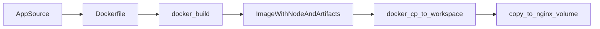

# Node 镜像：从哪里获取、选哪个版本、如何从应用变成可构建镜像

本文与 [jenkins.properties.example](jenkins.properties.example)、[Dockerfile.example](Dockerfile.example) 配套。

---

## 1. Node 从哪里「下载」

个人与 CI 场景下，**不推荐**在 NAS 上手工安装多份 Node tarball；推荐直接使用 **Docker 官方维护的 Node 镜像**，由 **Docker Hub** 在首次 `docker build` / `docker pull` 时自动拉取。

- **索引与标签说明**：[Docker Hub — node](https://hub.docker.com/_/node)
- **标签含义示例**：
  - `22.19.0-alpine`：Node **22.19.0**，基于 Alpine，镜像较小，适合构建。
  - `22-alpine`：随时间可能指向较新补丁版本，**生产构建建议锁小版本**。

拉取示例（可选，预下载）：

```bash
docker pull node:22.19.0-alpine
```

镜像缓存在本机 Docker 存储中，多项目可复用相同基础层。

---

## 2. 应该使用哪个版本的 Node

建议按下面顺序对齐，**避免口头约定**：

| 来源 | 作用 |
|------|------|
| **项目 `package.json` 的 `engines.node`** | 声明最低/推荐范围 |
| **`.nvmrc`（推荐）** | 本地与文档统一主版本，如 `22.19.0` |
| **`jenkins.properties` 的 `NODE_VERSION`** | 与 Dockerfile `ARG`、构建参数一致 |
| **Dockerfile** | `ARG NODE_VERSION=22.19.0` + `FROM node:${NODE_VERSION}-alpine` |

**原则**：对外可复现的构建应使用 **具体次版本**（如 `22.19.0`），而不是仅 `lts` 或 `22` 这类会漂移的标签。

---

## 3. 从「应用源码」到「可供 Docker 使用的镜像」

流程可以理解为三层：



1. **应用源码**：`package.json`、`package-lock.json`、业务代码、`.env.*`（构建期变量）等。
2. **Dockerfile**：声明 **基础镜像**（`FROM node:${NODE_VERSION}-alpine`）、`WORKDIR`、`COPY`、`RUN npm ci`、`RUN npm run ...`，在镜像文件系统内生成例如 `/app/.output/public`（Nuxt static）。
3. **`docker build`**（由 Jenkins 执行）：读取 **Dockerfile** 与 **构建参数**（`NODE_VERSION`、`NPM_SCRIPT`），生成**临时构建镜像**；该镜像内已包含 Node 与构建产物，**不要求**宿主机安装 Node。

与「在 Jenkins 里 Global Tool 装 Node」的区别：

- Node **只存在于构建镜像的层里**；
- 版本由 **Dockerfile 的 ARG / FROM** + **`jenkins.properties` 传入的 `--build-arg`** 锁定；
- 换版本 = 改 `jenkins.properties`（及必要时 Dockerfile 默认 ARG），**无需**改 Jenkins 全局工具配置。

---

## 4. 与 `jenkins.properties` 的「一处定义」

- **`NODE_VERSION`** 写在 **`jenkins.properties`** 一次。
- **Dockerfile** 中：`ARG NODE_VERSION=22.19.0`（默认值可与 properties 一致，便于本地 `docker build` 不传参）。
- **Jenkins** 中：`docker build ... --build-arg NODE_VERSION=${env.NODE_VERSION}`。

这样 **不会在 Jenkinsfile 里再写死一遍 22.19.0**（除非你愿意在仅本地调试时硬编码）。

---

## 5. 日常维护（磁盘与清理）

- 构建会产生大量中间镜像与 `<none>` 层，需定期关注 NAS 磁盘。
- 清理前确认无 Job 正在运行，再使用 `docker image prune` 等命令（详见各环境文档）。
