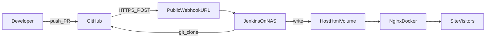

# GitHub 与 Jenkins 在 NAS 上的架构（替代 Gitea 镜像方案）

## 为何可以不再使用 Gitea 镜像

若目标只有：

- **代码权威在 GitHub**
- **构建与部署发生在 NAS**
- **对外只暴露站点（及 Jenkins Webhook）**

则 **不必**再引入 Gitea 做镜像：Jenkins Job 直接从 **GitHub** 拉取代码，在 NAS 上执行 `npm ci`、构建、将静态产物写入 Nginx 挂载目录并 `docker exec` reload。

Gitea 适合：需要 **内网 Git 托管、镜像备份、离线** 时再单独引入；与「纯 CI/CD」正交。

## 数据流（概念）

- **Webhook**：GitHub → 公网可达 URL → Jenkins（**入站**）。
- **克隆代码**：Jenkins → GitHub（**出站**，需凭据）。
- **站点访问**：用户 → 隧道 → Nginx（**入站**）。

## NAS 上的 Docker 与 Nginx

- **Nginx**：容器内提供静态文件；宿主目录挂载到容器内 `html`（如 `/vol1/.../docker/nginx/html`）。各项目在自有 [Jenkinsfile](../Jenkinsfile) 中配置 `HTML_ROOT`、`PROJECT_SLUG` 与各环境 `SEGMENT_*`，部署时 `mkdir -p` 创建目录（见 [05-jenkins-conventions.md](05-jenkins-conventions.md)）。
- **Jenkins**：可安装在宿主或 Docker 中；**构建**使用 [Global Tool Node](05-jenkins-conventions.md) 或等价方式；**部署**阶段需能执行 `docker exec`（见 [05](05-jenkins-conventions.md)）。

## 与 static-demo 仓库的对应关系

- 流水线逻辑见根目录 [Jenkinsfile](../Jenkinsfile)（分支映射、`TARGET_ENV`、部署目录、`NGINX_CONTAINER`）。
- 若 Jenkins 与 Nginx 路径约定变更，请同时改 Jenkinsfile 与 Nginx 挂载配置。
